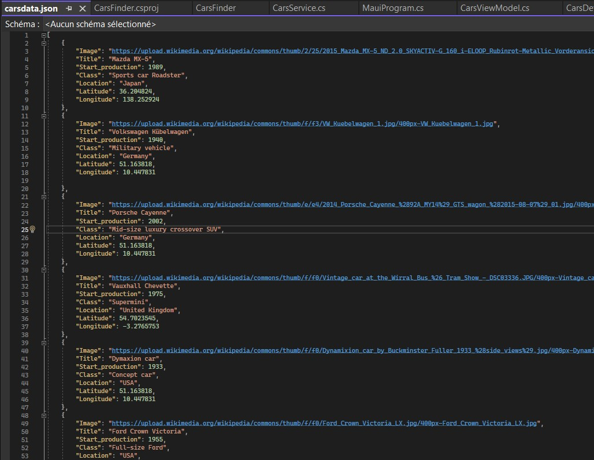
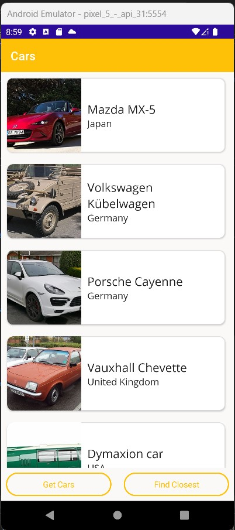
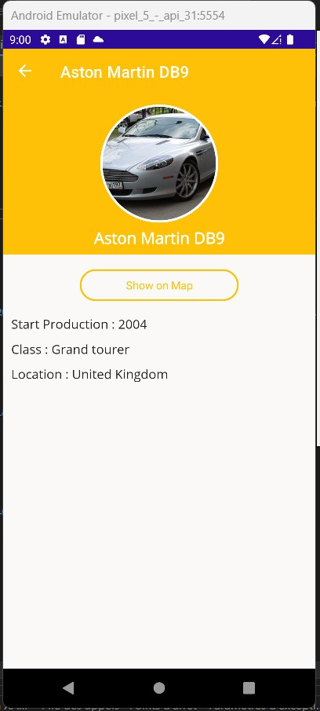
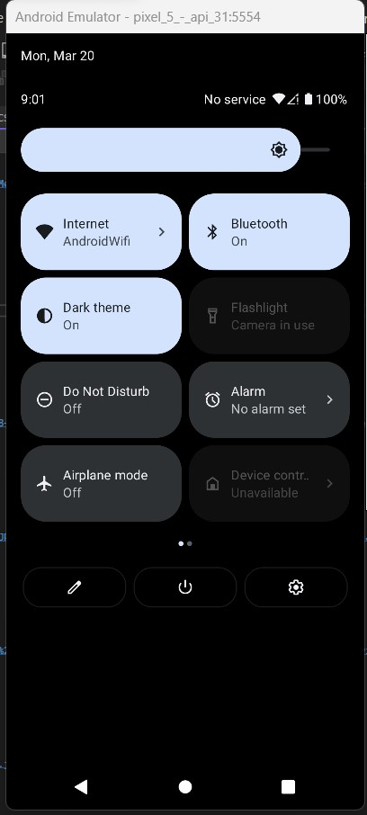

# FBP-FG-ex009-.NETMAUI
.NET MAUI application

 
JSON DATASET : Cars
 
Features :
  - Image
  - Title
  - Start Production
  - Class
  - Location
  - Latitude
  - Longitude
 

 
Test video :
 
https://user-images.githubusercontent.com/97790963/226311462-943768c4-cad2-4860-8408-12ae7603d7c3.mp4

NB : Dark mode seems to not working on my emulater

